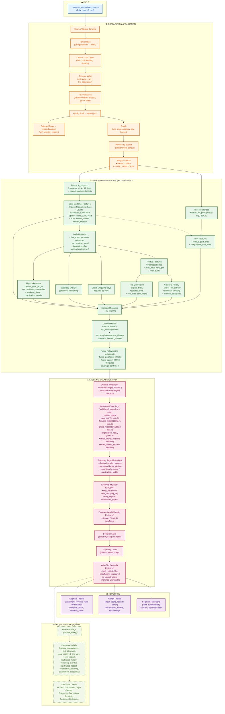

```mermaid
flowchart TD
    %% =============================================
    %% HIGH-LEVEL DATA PIPELINE (retail-analytics v1.4.0)
    %% =============================================
    
    subgraph INPUT["📥 INPUT"]
        SRC["customer_transactions.parquet\n(2.6M rows × 9 cols)"]
    end

    subgraph PREP["⚙️ PREPARATION & VALIDATION"]
        SCAN["Scan & Validate Schema"]
        PARSE["Parse Dates\n(String/Datetime → Date)"]
        CLEAN["Clean & Cast Types\n(Strip, null handling, Float64)"]
        VALUE["Compute Value\n(unit: price × qty | line_total: price)"]
        VALIDATE["Row Validation\n(Required fields, price≥0, qty>0, finite)"]
        AUDIT["Quality Audit → quality.json"]
        REJECT["Rejected Rows → rejected.parquet\n(with rejection_reason)"]
        ENRICH["Enrich\n(unit_price, category_key, bucket)"]
        PARTITION["Partition by Bucket\n→ partitions/b{N}.parquet"]
        CHECKS["Integrity Checks\n• Basket conflicts\n• Product variation audit"]
    end

    subgraph SNAPSHOT["📸 SNAPSHOT GENERATION (per cutoff date C)"]
        PRICE_REF["Price References\nMedian unit_price/product in [C-364, C]"]
        BASKETS["Basket Aggregation\n(customer_id, txn_id, date)\n→ spend, products, breadth"]
        BASE["Base Customer Features\n• History: first/last purchase\n• Counts: purchases_30/90/365d\n• Spend: spend_30/90/365d\n• AOV, median_basket, median_breadth"]
        DAILY["Daily Features\n• day_spend, products, categories\n• gap, relative_spend\n• Jaccard overlap (products/categories)"]
        RHYTHM["Rhythm Features\n• median_gap, gap_cv\n• product/category overlap\n• weekend_share, reactivation_events"]
        WEEKDAY["Weekday Entropy\n(Shannon, natural log)"]
        BREADTH["Last 6 Shopping Days\n(requires ≥6 days)"]
        PROD["Product Features\n• trial/repeat dates\n• prior_days, next_gap\n• relative_qty"]
        TRIALS["Trial Conversion\n• eligible_trials, repeated_trials\n• core_size, core_spend"]
        CAT["Category History\n• share, HHI, entropy\n• dominant category\n• overdue_categories"]
        PRICE_FEAT["Price Features\n• relative_paid_price\n• comparable_price_lines"]
        MERGE["Merge All Features\n→ 79 columns"]
        DERIVED["Derived Metrics\n• tenure, recency, aov_recent/previous\n• frequency/basket/spend_change\n• lateness, breadth_change"]
        FOLLOWUP["Future Followup (no lookahead)\n• future_purchases_30/90d\n• future_spend_30/90d\n• Requires coverage_confirmed"]
    end

    subgraph LABEL["🏷️ LABELING & CLASSIFICATION"]
        THRESH["Quantile Thresholds\n(value/basket/gap P33/P80)\nComputed at first eligible snapshot"]
        STYLE["Behavioral Style Tags\n(Multi-label, precedence order)\n• routine_repeat (gap_cv≤.75, est≥.7)\n• focused_repeat (dom≥.7, est≥.7)\n• broad_repeat (breadth≥3, est≥.7)\n• exploration_heavy (new≥.4)\n• large_basket_episodic (quantile)\n• small_basket_frequent (quantile)"]
        TRAJ["Trajectory Tags (Multi-label)\n• slowing / smaller_baskets\n• narrowing / broad_decline\n• expanding / overdue / reactivated / stable"]
        LIFECYCLE["Lifecycle (Mutually Exclusive)\n• first_observed / one_shopping_day\n• early_repeat / established_repeat"]
        EVIDENCE["Evidence Level (Mutually Exclusive)\n• stronger / limited / insufficient"]
        BEHAVIOR["Behavior Label\n(joined style tags or status)"]
        TRAJ_L["Trajectory Label\n(joined trajectory tags)"]
        VALUE_TIER["Value Tier (Mutually Exclusive)\n• high / middle / low\n• insufficient_exposure / no_recent_spend\n• reference_unavailable"]
    end

    subgraph REPORTS["📊 REPORTING"]
        SEG["Segment Profiles\n(customers, revenue, rates by behavior)\ncustomer_share, revenue_share"]
        COHORT["Cohort Profiles\n(mean spend, rates by cohort)\nobservation_months, tenure range"]
        TRANS["Segment Transitions\n(rates by dimension)\nSum to 1 per origin label"]
    end

    subgraph PATRONAGE["🎯 PATRONAGE LAYER (Additive)"]
        PAT_BUILD["Build Patronage\n→ patronage/{key}/"]
        PAT_LABEL["Patronage Labels\n(capture_unconfirmed, first_observed,\nlong_observed_one_day, recent_repeat,\ninsufficient_history, recurring_overdue,\nreactivated_repeat, established_recurring,\nestablished_occasional)"]
        PAT_VIEWS["Dashboard Views\nProfiles, Distributions, Style Overlap,\nCategories, Transitions, Sensitivity,\nCustomer, Definitions"]
    end

    %% Connections
    SRC --> SCAN --> PARSE --> CLEAN --> VALUE --> VALIDATE --> AUDIT
    AUDIT --> REJECT
    AUDIT --> ENRICH --> PARTITION --> CHECKS
    
    CHECKS --> PRICE_REF
    CHECKS --> BASKETS
    BASKETS --> BASE
    BASE --> DAILY --> RHYTHM
    DAILY --> WEEKDAY
    DAILY --> BREADTH
    DAILY --> PROD --> TRIALS
    PROD --> CAT
    BASE -.-> PRICE_FEAT
    PRICE_REF -.-> PRICE_FEAT
    
    BASE --> MERGE
    RHYTHM --> MERGE
    WEEKDAY --> MERGE
    BREADTH --> MERGE
    TRIALS --> MERGE
    CAT --> MERGE
    PRICE_FEAT --> MERGE
    
    MERGE --> DERIVED --> FOLLOWUP
    
    FOLLOWUP --> THRESH --> STYLE --> TRAJ --> LIFECYCLE --> EVIDENCE --> BEHAVIOR --> TRAJ_L --> VALUE_TIER
    
    VALUE_TIER --> SEG
    VALUE_TIER --> COHORT
    VALUE_TIER --> TRANS
    
    %% Patronage connections (additive, reads from snapshots)
    VALUE_TIER -.-> PAT_BUILD
    SEG -.-> PAT_BUILD
    PAT_BUILD --> PAT_LABEL --> PAT_VIEWS

    %% Styling
    classDef input fill:#e3f2fd,stroke:#1565c0,stroke-width:2px,color:#0d47a1
    classDef prep fill:#fff3e0,stroke:#ef6c00,stroke-width:2px,color:#e65100
    classDef snap fill:#e8f5e9,stroke:#2e7d32,stroke-width:2px,color:#1b5e20
    classDef label fill:#fce4ec,stroke:#c2185b,stroke-width:2px,color:#880e4f
    classDef report fill:#f3e5f5,stroke:#7b1fa2,stroke-width:2px,color:#4a148c
    classDef patronage fill:#f1f8e9,stroke:#558b2f,stroke-width:2px,stroke-dasharray: 5 5,color:#33691e
    
    class SRC input
    class SCAN,PARSE,CLEAN,VALUE,VALIDATE,AUDIT,REJECT,ENRICH,PARTITION,CHECKS prep
    class PRICE_REF,BASKETS,BASE,DAILY,RHYTHM,WEEKDAY,BREADTH,PROD,TRIALS,CAT,PRICE_FEAT,MERGE,DERIVED,FOLLOWUP snap
    class THRESH,STYLE,TRAJ,LIFECYCLE,EVIDENCE,BEHAVIOR,TRAJ_L,VALUE_TIER label
    class SEG,COHORT,TRANS report
    class PAT_BUILD,PAT_LABEL,PAT_VIEWS patronage
```